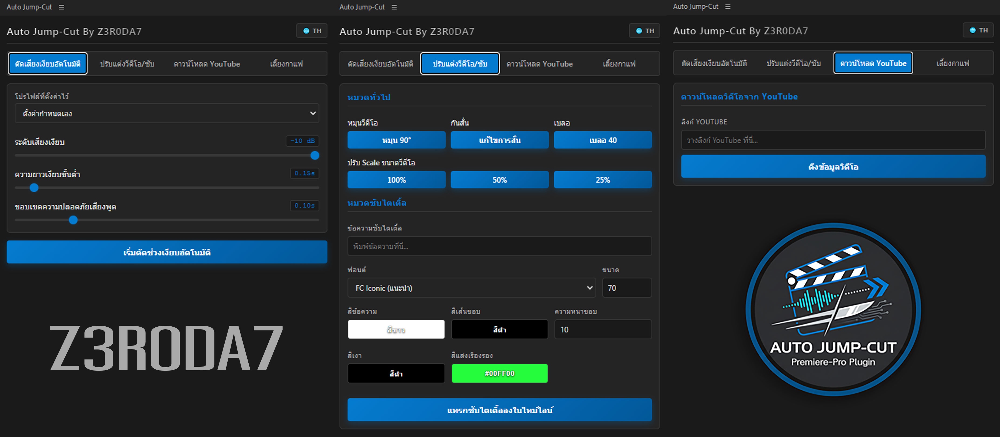

# Auto-Jump-Cut-Premiere-Pro
Auto Jump-Cut คือปลั๊กอินสำหรับ Adobe Premiere Pro ที่ช่วย **ตัดเสียงเงียบอัตโนมัติ ปรับแต่งวิดีโอ และสร้างซับไตเติ้ลได้รวดเร็ว** เพื่อลดเวลาการตัดต่อและเพิ่มความสะดวกในการทำงานวิดีโอแบบมืออาชีพ โดยใช้ AI ช่วยเขียนให้ตรงตามการใช้งานของผู้ทำเอง

รองรับการใช้งาน : โปรแกรม Adobe Premiere Pro CC 2020 (เวอร์ชัน 14.0) หรือใหม่กว่า บนระบบปฏิบัติการ Windows

---------------------------------------

ดาวน์โหลดได้ที่ :  
v1.2.0 https://drive.google.com/file/d/13JodR_jDXSQ4XYdgoKtpfR0PZv3xQvqx/view?usp=sharing  
v1.0.0 https://drive.google.com/file/d/1-eMKlvL0Sx43u3-F8jjYyxN7toAe0wza/view?usp=sharing

---------------------------------------

**อัพเดต**  
5/6/69  
อัพเดตระบบเพิ่ม (v1.2.0) 
-เพิ่มคำสั่งเบลอทางลัด  
-เพิ่มเมนูโหลด Youtube ลงในไทม์ไลน์โปรแกรมได้เลย  

2/6/69  
- แก้บัค อัพ Node.js ลงไปพร้อมในตัวติดตั้งเลยไม่ต้องติดตั้งแยก  
